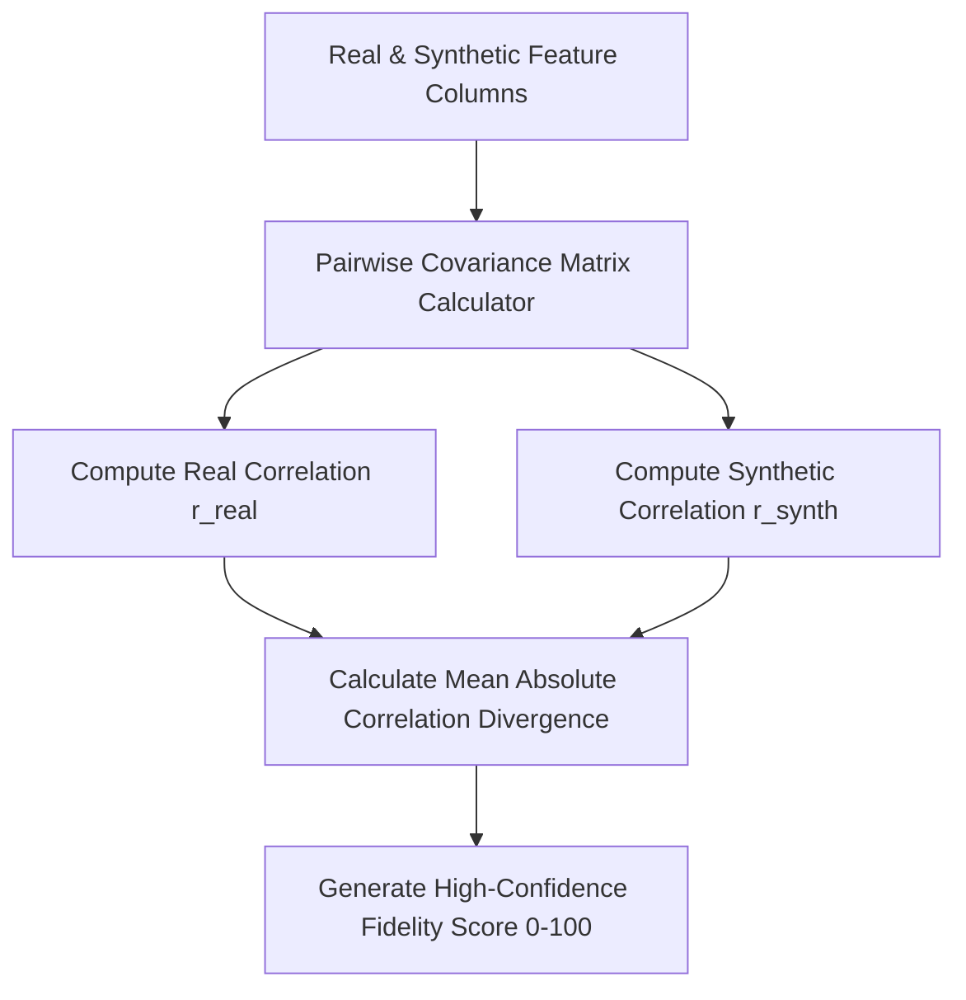

# GenPark AI Agent Skill - Synthetic Tabular Correlation Copula Aligner

Measures multi-attribute feature correlation fidelity between real datasets and synthetic generated distributions.

Verified by [GenPark AI](https://genpark.ai) and compatible with [Model Context Protocol (MCP)](https://genpark.ai/mcp).

## Architecture Diagram

## Features
- **Fidelity Quality Score**: Accurately flags mode collapse and synthetic decorrelation artifacts.
- **Zero External Dependencies**: Standard library Python 3.9+.
